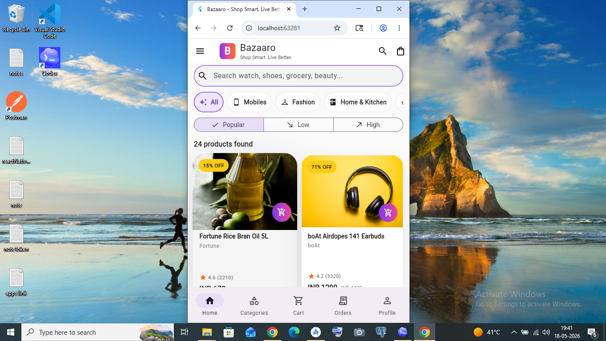
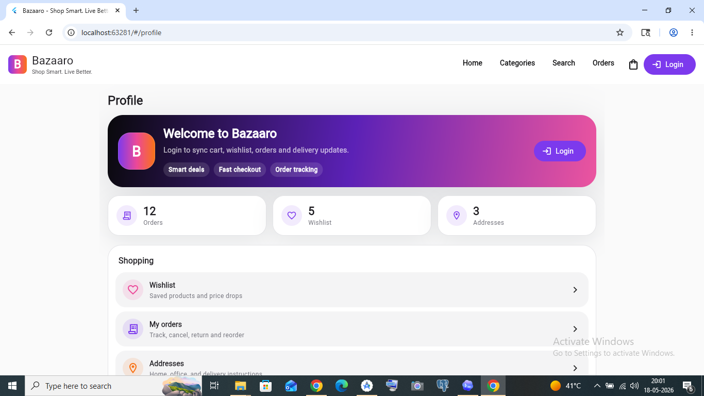
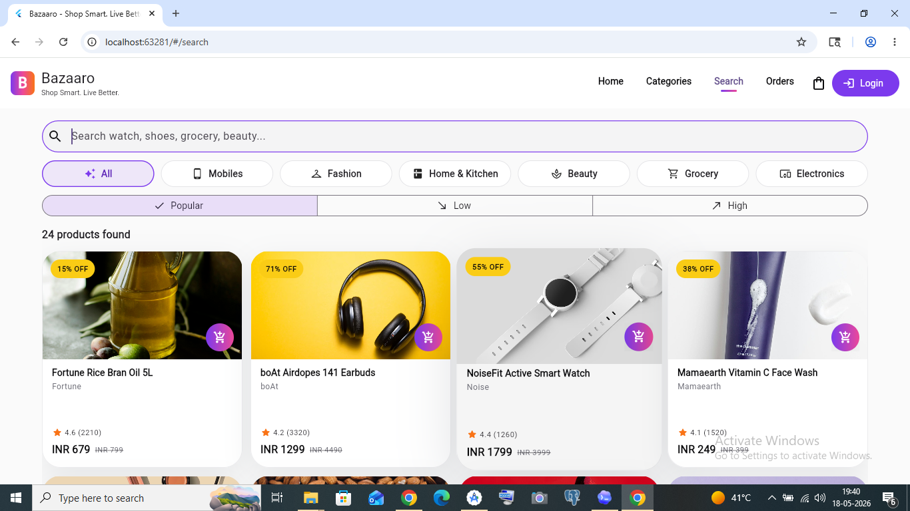
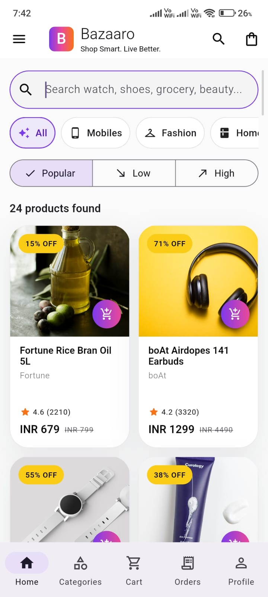
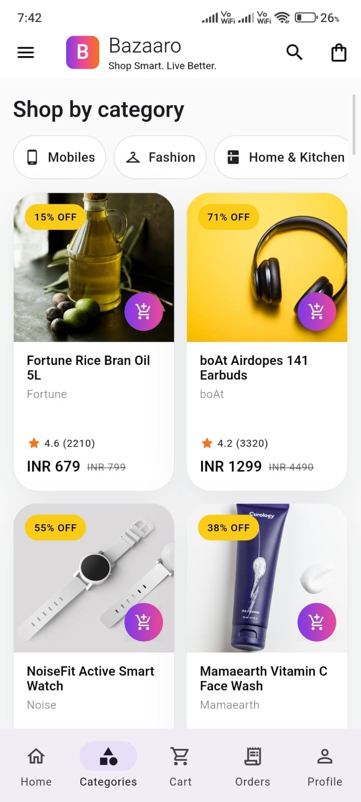
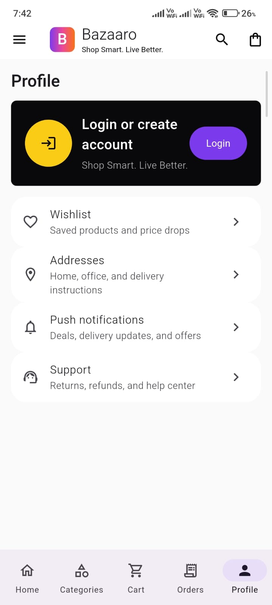

# Bazaaro

Bazaaro is a Flutter e-commerce monorepo for customer, admin, seller, and staff experiences.

Tagline: **Shop Smart. Live Better.**

Live web app: [Bazaaro on GitHub Pages](https://rsumit1618.github.io/Bazaaro/)



Primary domains:

- Customer: `bazaaro.in`
- Admin: `admin.bazaaro.in`
- Seller: `seller.bazaaro.in`

## Demo Users

Use these demo records when seeding Firebase Realtime Database or reviewing role-based flows:

| Role | Name | Email | Password |
| --- | --- | --- | --- |
| Customer | Aarav Sharma | `aarav.sharma@bazaaro.in` | `Demo@12345` |
| Admin | Meera Iyer | `admin@bazaaro.in` | `Demo@12345` |
| Seller | Bazaaro Select Seller | `seller@bazaaro.in` | `Demo@12345` |
| Staff | Kabir Khan | `staff@bazaaro.in` | `Demo@12345` |

## Screenshots

### Web






### Mobile

| Home | Search |
| --- | --- |
|  |  |
| Categories | Profile |
|  |  |

More screenshot notes are available in [Screenshots](docs/SCREENSHOTS.md).

## Current Focus

The current implementation focuses on the customer app presentation layer with production-style responsive UI, local seed data, local-first catalog loading, cart/order/login flows, and Firebase Realtime Database integration points.

## Workspace

```text
bazaaro/
  apps/
    customer_app/
    admin_panel/
    seller_panel/
    staff_app/
  packages/
    bazaaro_core/
    bazaaro_auth/
    bazaaro_data/
    bazaaro_domain/
    bazaaro_ui/
    bazaaro_firebase/
  docs/
  seed/
  melos.yaml
  firebase.json
  database.rules.json
```

## Architecture

Bazaaro uses Clean Architecture with MVVM-style presentation state:

- `bazaaro_core`: brand constants, app config, enums, failures, result helpers, slug utilities.
- `bazaaro_domain`: entities, repository contracts, use cases.
- `bazaaro_data`: shared paths, mappers, local/in-memory repository support.
- `bazaaro_firebase`: Firebase bootstrap, Realtime Database providers, Firebase repositories.
- `bazaaro_auth`: auth providers and route guard foundations.
- `bazaaro_ui`: theme, responsive helpers, reusable widgets, shell/navigation UI.
- `apps/*`: app-specific routing, screens, ViewModels, Riverpod providers, feature composition.

Riverpod is used for dependency injection and state management. RxDart and App Stream Kit are used for debounced search, shared streams, cart/order stream UI, and realtime-friendly UI builders.

## Apps

- `apps/customer_app`: mobile and web shopping app.
- `apps/admin_panel`: web dashboard shell for admin workflows.
- `apps/seller_panel`: web dashboard shell for seller workflows.
- `apps/staff_app`: mobile/web staff shell for inventory, orders, support, marketing, and content roles.

## Quick Start

```bash
flutter pub global activate melos
melos bootstrap
melos run customer
```

Run on a specific target:

```bash
cd apps/customer_app
flutter run -d chrome
flutter run -d <android-device-id>
```

On Windows, enable Developer Mode before bootstrapping because Flutter plugin packages use symlinks.

## Firebase And Offline

The app can work with Firebase Realtime Database when configured. It also has a local-first catalog path so the customer UI can still load product/category/banner seed data when Firebase is not ready or the user is offline.

For full details, see:

- [Architecture](docs/ARCHITECTURE.md)
- [Firebase, Hosting, and Offline Guide](docs/FIREBASE_HOSTING_OFFLINE.md)
- [Setup Guide](docs/SETUP.md)
- [Commands and Deployment](docs/COMMANDS_AND_DEPLOYMENT.md)
- [Screenshots](docs/SCREENSHOTS.md)
- [Challenges Faced](docs/CHALLENGES.md)
- [Reviewer Guide](docs/REVIEW_GUIDE.md)
- [Monorepo Interview Questions](docs/MONOREPO_INTERVIEW_QUESTIONS.md)
