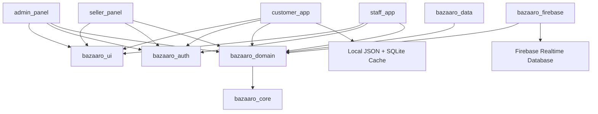
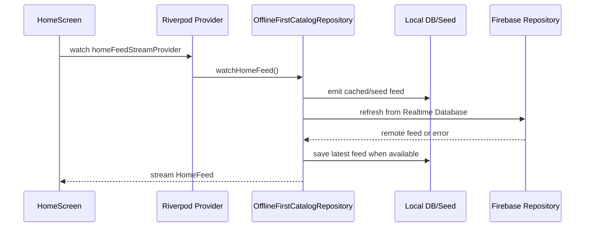

# Bazaaro Architecture

Bazaaro is designed as a Flutter monorepo so multiple apps can share business rules, UI components, Firebase infrastructure, and domain models without copying code.

## High-Level Design



## Why Monorepo

The project has multiple user-facing applications:

- Customer mobile/web app
- Admin web panel
- Seller web panel
- Staff mobile/web app

These apps need different routes and screens, but they share the same product, order, cart, user, role, and catalog concepts. A Melos monorepo lets the team:

- Share domain entities across apps.
- Keep one design system.
- Keep one Firebase integration layer.
- Add app-specific presentation without duplicating business rules.
- Version and review all related changes together.

## Clean Architecture Layers

### Presentation Layer

Location:

```text
apps/customer_app/lib/src/features/*
```

Responsibilities:

- Screens and widgets
- GoRouter route handling
- ViewModels and controllers
- Riverpod providers
- User interaction
- Loading, empty, error, and offline UI states

Examples:

- `home_screen.dart`
- `search_screen.dart`
- `cart_screen.dart`
- `checkout_screen.dart`
- `customer_state.dart`
- `catalog_providers.dart`

### Domain Layer

Location:

```text
packages/bazaaro_domain/lib/src
```

Responsibilities:

- Pure Dart entities
- Repository interfaces
- Use cases
- Query objects

Domain does not depend on Flutter UI or Firebase implementation details.

Examples:

- `Product`
- `Category`
- `CustomerOrder`
- `CatalogRepository`
- `CommerceRepository`
- `GetHomeFeedUseCase`
- `SearchProductsUseCase`
- `AddToCartUseCase`

### Data Layer

Location:

```text
packages/bazaaro_data/lib/src
apps/customer_app/lib/src/features/catalog/local_*.dart
```

Responsibilities:

- Data mapping
- Firebase key/path definitions
- Local seed repository
- SQLite/local database support
- Offline-first repository composition

### Infrastructure Layer

Location:

```text
packages/bazaaro_firebase/lib/src
```

Responsibilities:

- Firebase initialization
- Realtime Database providers
- Firebase repository implementations
- Firebase error isolation

## MVVM In This Project

Bazaaro uses MVVM as a presentation pattern on top of Clean Architecture.

- View: Flutter screen/widget.
- ViewModel: screen-specific state and stream logic.
- Model: domain entities and use cases.

Examples:

- `ProductSearchViewModel` owns the search query stream and product result stream.
- `CustomerSessionController` owns login/logout customer state.
- `CartController` owns cart item state and exposes an RxDart stream.
- `OrderController` owns order placement/tracking state and exposes an RxDart stream.

## Riverpod Usage

Riverpod is used for:

- Dependency injection
- Feature-level providers
- StateNotifier controllers
- StreamProvider data loading
- Repository switching between Firebase and local fallback

Important providers:

```text
catalogRepositoryProvider
homeFeedStreamProvider
homeFeedProvider
productDetailProvider
productSearchViewModelProvider
customerSessionProvider
cartProvider
ordersProvider
```

## RxDart Usage

RxDart is used where the app needs stream composition:

- Debounced search filters
- Shared home feed stream
- Cart updates
- Order updates
- Offline-first refresh trigger
- Future realtime database stream handling

Examples:

- `BehaviorSubject` for search criteria.
- `shareReplay(maxSize: 1)` to avoid duplicate stream listens and cache the last value.
- Debounce before filtering/searching.

## App Stream Kit Usage

`app_stream_kit` is used to reduce repeated stream UI boilerplate.

Current usage:

- `AppStreamBuilder` for home feed, search results, and orders.
- `AppStreamConsumer` for cart state.

This keeps loading, empty, error, and data rendering consistent.

## Role-Based Application Strategy

Roles:

- `superAdmin`
- `admin`
- `seller`
- `inventoryManager`
- `orderManager`
- `supportAgent`
- `marketingManager`
- `contentManager`
- `customer`

Each role gets a different app route surface:

- Customer app: browse, cart, checkout, orders, profile.
- Admin panel: users, sellers, staff, catalog, orders, coupons, banners, reports, config.
- Seller panel: own products, variants, stock, orders, earnings, profile.
- Staff app: role-based operations for stock, order status, support, marketing, and content.

## Data Flow Example: Home Feed



## Reviewer Notes

The customer app is intentionally local-first for demo stability. Firebase can be connected without blocking the UI. If Firebase fails, the UI still renders from seed/local data.
